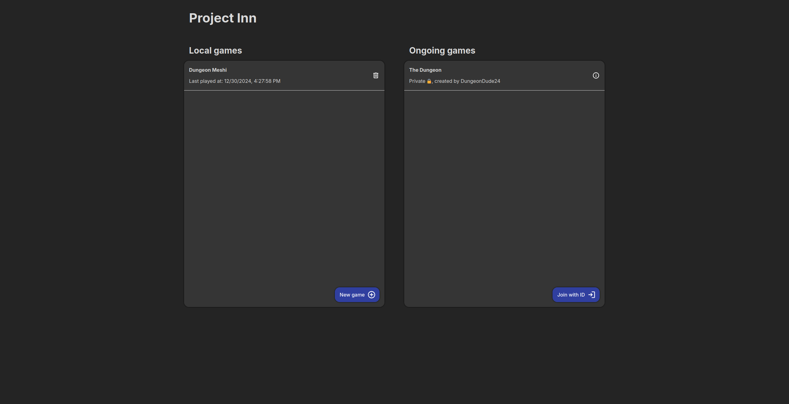

# ProjectInn
A simple, quick, and easy to use virtual tabletop application designed to play role playing games like Dungeons & Dragons and Pathfinder.

## Features
🎨 Import your own assets and use them as tokens or maps\
🔒 Robust permission system, enabling the DM to assign tokens and choose what each user can do\
✏️ Easily manage your characters by adding stats and notes to your tokens\
💾 Save and autosave functionality, so that losing your games won't ever be an issue\
🗨 A simple chat with some useful tricks like dice rolling

## Screenshots

## Setup
A hosted instance of ProjectInn can be found on my website at https://topox.dev/ProjectInn.
If you're looking to self-host follow the guide below.
